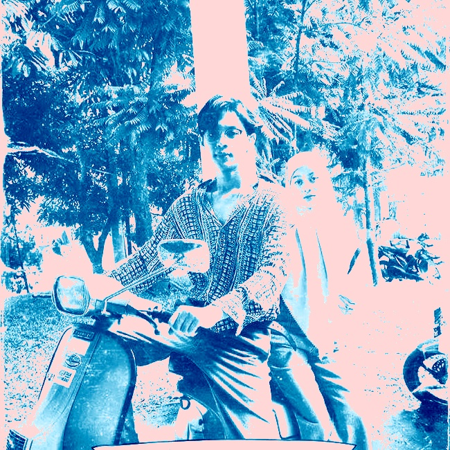

## 📘Image Enhancement & Colorization using OpenCV
Proyek ini bertujuan untuk melakukan peningkatan kualitas gambar grayscale melalui 
berbagai teknik pemrosesan citra, seperti penyesuaian intensitas, pewarnaan menggunakan colormap, 
penguatan warna berbasis HSV, dan opsional denoising.
## ✨ Fitur Utama
Penyesuaian Intensitas
Meningkatkan brightness dan contrast gambar grayscale.

Pewarnaan dengan ColorMap
Mengubah gambar hitam putih menjadi gambar berwarna menggunakan colormap seperti OCEAN.

Penguatan Warna (HSV Tuning)
Mengatur hue, saturation, dan value agar warna tampak lebih hidup.

Optional Denoising (bisa ditambahkan dengan parameter)
Mengurangi noise pada gambar menggunakan OpenCV.

Visualisasi Hasil
Menampilkan perbandingan gambar sebelum dan sesudah pemrosesan.

Export Hasil
Menyimpan gambar hasil sebagai file baru.
## 📦 Instalasi

# Clone repository
```bash
git clone https://github.com/username/nama-repo.git
cd nama-repo
```

#Install requirements
```bash
pip install -r requirements.txt
```

## 🗂 Struktur Project
```bash
📁 nama-project
├── img-2.jpeg              # Input gambar grayscale
├── foto_modern.jpg         # Output gambar hasil proses
├── main.py                 # Script utama
├── README.md               # Dokumentasi
└── requirements.txt        # Dependency
```
## ▶️ Cara Menggunakan
1. Masukkan file gambar grayscale ke dalam folder project
2. Jalankan script:
   ```bash
   python main.py
   ```
3. Hasil akan muncul:
Dalam jendela Matplotlib (Before–After)
Disimpan sebagai foto_modern.jpg

## ⚙️ Parameter yang Digunakan
1. Brightness (β)
Mengatur tingkat kecerahan gambar.
Nilai lebih besar → gambar lebih terang
```bash
beta = 20
```
2. Contrast (α)
Mengatur perbedaan gelap-terang.
Nilai > 1 → kontras meningkat
```bash
alpha = 1.3
```
3. Saturation Adjustment
Memberikan warna lebih hidup.
```bash
s = cv2.add(s, 40)
```
4. Value (Brightness HSV)
Mencerahkan gambar setelah pewarnaan.
```bash
v = cv2.add(v, 20)
```
## 🖼 Contoh Hasil
Sebelum (Grayscale)
- Gambar hitam putih standar tanpa warna
Sesudah (Enhanced Colorized Image)
- Warna lebih modern
- Kontras meningkat
- Saturasi lebih hidup
- Detail lebih jelas
  ```scss
  
  
  ```
## 🧠 Teknik Pemrosesan yang Digunakan
1.Intensity Transformation (Brightness & Contrast)
```bash
cv2.convertScaleAbs(image, alpha, beta)
```
2.Color Mapping
```bash
cv2.applyColorMap(img_adj, cv2.COLORMAP_OCEAN)
```
3.HSV Color Adjustment
- Mengubah ruang warna BGR → HSV
- Memodifikasi saturation & value
- Mengembalikan ke BGR

## 🔧 Modified Code dengan Path yang Lebih Baik
```pyhton

import cv2
import numpy as np
from matplotlib import pyplot as plt

# === 1. Baca Gambar Hitam Putih ===
img_gray = cv2.imread('img-2.jpeg', cv2.IMREAD_GRAYSCALE)

if img_gray is None:
    print("❌ Gambar tidak ditemukan!")
    exit()

# === 2. Penyesuaian Intensitas (Brightness & Contrast) ===
alpha = 1.3  # kontras
beta = 20    # kecerahan
img_adj = cv2.convertScaleAbs(img_gray, alpha=alpha, beta=beta)

# === 3. Buat Warna Dasar dengan Color Map ===
# Kita pakai colormap natural seperti OCEAN atau PINK untuk dasar pewarnaan
colorized = cv2.applyColorMap(img_adj, cv2.COLORMAP_OCEAN)

# === 4. Penyesuaian Warna Tambahan (Hue & Saturation) ===
# Konversi ke HSV untuk ubah saturasi dan hue agar tampak alami
hsv = cv2.cvtColor(colorized, cv2.COLOR_BGR2HSV)

h, s, v = cv2.split(hsv)
s = cv2.add(s, 40)   # Tambah saturasi (warna lebih hidup)
v = cv2.add(v, 20)   # Tambah intensitas (lebih terang)

# Gabungkan lagi
hsv = cv2.merge((h, s, v))
final_img = cv2.cvtColor(hsv, cv2.COLOR_HSV2BGR)

# === 5. Tampilkan Hasil ===
plt.figure(figsize=(10,5))
plt.subplot(1,2,1)
plt.title("Asli (Hitam Putih)")
plt.imshow(img_gray, cmap='gray')
plt.axis('off')

plt.subplot(1,2,2)
plt.title("Setelah Penyesuaian Intensitas & Warna")
plt.imshow(cv2.cvtColor(final_img, cv2.COLOR_BGR2RGB))
plt.axis('off')

plt.show()

# === 6. Simpan Hasil ===
cv2.imwrite('foto_modern.jpg', final_img)
print("✅ Gambar sudah disimpan sebagai 'foto_modern.jpg'")


